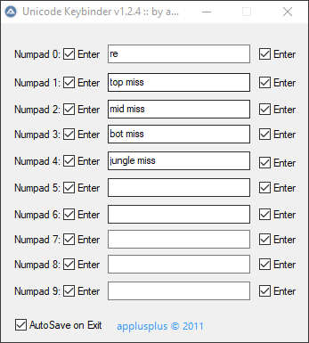

# Unicode Keybinder
My old AutoIt project from 2011, 2012.  
A "Keybinder" is a tool that is used to write a special command or message to a ingame chat or console.  
For example: In League of Legends, if an enemy went missing from his lane, it's important to inform your teammates about it, to prevent a "gang".

